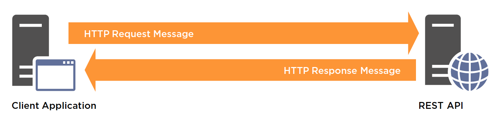

# Scope

The essential features that characterize an Ed-Fi REST API implementation are
the data model that serves as its basis and the REST architectural style.

## Data Model

The Ed-Fi Unifying Data Model (UDM)[\[1\]](#f1) provides the basis for the
data transferred and manipulated by an Ed-Fi REST API implementation. The Ed-Fi
UDM is a structured, conceptual model of common K–12 education data. The model
includes entities that are easily recognized by educators and administrators:
schools, students, teachers, attendance, grades, assessment results, and many
others. These entities contain attributes (i.e., properties) that are also
easily recognized. For example, assessment results contain data, such as a score
and the date the assessment was administered. The UDM also includes associations
(i.e., relationships) between entities, such as the association between students
and schools.

REST interfaces are built around Resources that define nouns. In the education
domain, these nouns include such things as schools, students, and teachers. In
the Ed-Fi UDM these nouns have been rigorously defined as "entities," with
specific attributes and associations. Compositions of entities, with their
attributes and associations, are called "domain aggregates." These are
identified from the Ed-Fi UDM according to the principles of Domain-Driven
Design (DDD).[\[2\]](#f2) Domain aggregates are the Resources for an Ed-Fi
REST API. These concepts are discussed in more detail later in this document.

An Ed-Fi REST API may cover a subset of the full Ed-Fi UDM that is exposed and
exchanged in a particular system or implementation. The API need not be
implemented for the entire scope of the Ed-Fi UDM in order to be aligned.

## Architectural Style

The REST architectural style[\[3\]](#f3) is a convention-based approach to
defining APIs. HTTPS (Hypertext Transfer Protocol Secure), using the HTTP
methods (GET, PUT, POST, DELETE, etc.), as the application protocol.

REST-style architectures consist of clients and servers. Clients initiate
requests to servers; servers process requests and return appropriate responses.
Requests and responses are built around the transfer of representations of
Resources. As depicted below, a data store or server-based application
implements, exposes, or is wrapped with an Ed-Fi REST API to allow client
applications to exchange and manipulate education data.

**Figure 1.** Interaction between REST API and client application

APIs can be thought of as a "contract" between data sources and client
applications. The underlying platform and application choices are unimportant in
terms of this contract. An Ed-Fi REST API follows this pattern. An Ed-Fi REST
API levies no technical requirements on how data is internally stored or how it
is used by client applications. The API must only provide the technical contract
between a provider of data and its consumer applications, externally
representing the exchanged data Resources in a way that is aligned with the
Ed-Fi UDM.

The same resource may be represented to different clients using different
representations. For example, an API may represent a resource as JSON for an
application that is performing transactions, but may use XML to represent the
same resource to another application for bulk data export. The representation is
a way to externally represent the resource, but is not the resource itself.

There may be circumstances where an Ed-Fi REST API would diverge from a pure
REST approach to support specific use cases, for example, to support
application-specific operations.

While the Ed-Fi XML Data Exchange Framework allows for file-based exchange of
education data between systems, an Ed-Fi REST API extends this capability to
include real-time and transactional exchanges of information.

------

1. For more information about the Ed-Fi Unifying Data Model, see
[here](https://techdocs.ed-fi.org/display/EFDS31/Ed-Fi+Unifying+Data+Model).

2. See, e.g., Evans, Eric, et al. (2006), [Domain-Driven Design
Quickly](http://www.infoq.com/minibooks/domain-driven-design-quickly), C4Media
Inc., for a brief outline of Domain-Driven Design principles.

3. The key principles of REST are outlined in Fielding, Roy Thomas (2000),
[Architectural Styles and the Design of Network-Based Software
Architectures](http://www.ics.uci.edu/~fielding/pubs/dissertation/top.htm),Doctoral
dissertation, University of California, Irvine.

## API Guidelines Contents

* [Scope](SCOPE.md)
* [Key Characteristics](KEY-CHARACTERISTICS.md)
* [Requirement Levels](REQUIREMENT-LEVELS.md)
* [API Design Guidelines](API-DESIGN-GUIDELINES/README.md)
* [API Implementation Guidelines](API-IMPLEMENTATION-GUIDELINES/README.md)
