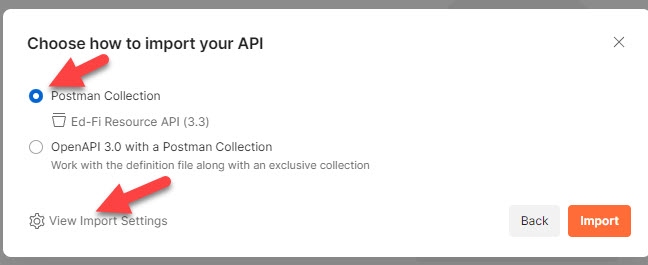
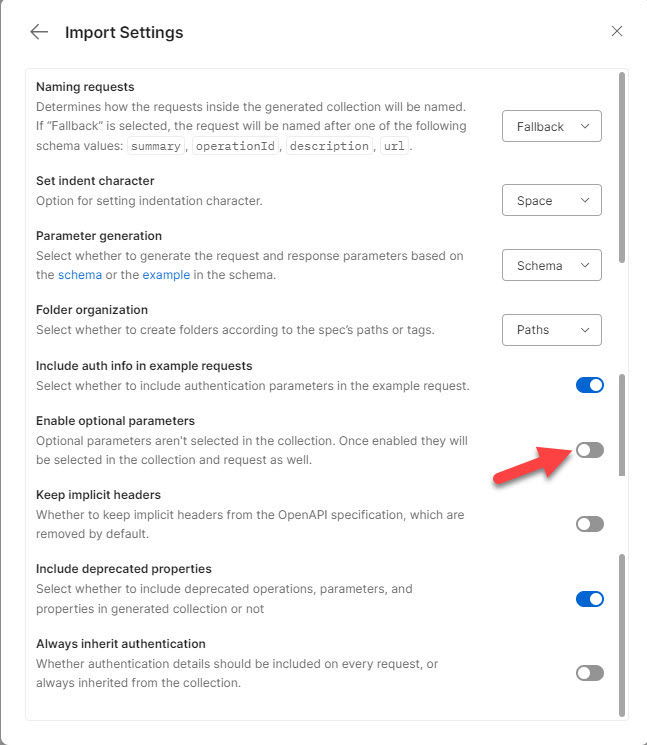

# Import, Cleaning, and Export with Postman

> [!TIP]
> These instructions are only applicable when manually importing OpenAPI to
> Postman, instead of using the [auto-generation with
> Portman](./AUTO-GEN-TESTS.md) approach.

## Import Into Postman

1. In Postman, click the import button.
2. Select the YML file.
3. Choose to import as a Postman collection.\
   
4. Before clicking the import button, modify the settings by turning off
   optional parameters.\
   

## Export to File

1. Click the `...` button at the root of the collection.
2. Choose Export.
3. In the Export Collection window, choose "Collection v2.1".
4. Do NOT click the "share Collection" button. Click the Export button.
5. Save the file in the same directory as the Open API spec file, with the same
   base name (but different extension: `.postman.json` instead of `.yml`).

### Modifying the Base URL for the Resource API

The YML files for the Resources API have routes/endpoints like
`/ed-fi/academicWeeks` and `/tpdm/candidates`. The ODS/API places these routes
after `/data/v3`, but this is not a canonical requirement - hence those two
route segments are not in the YML. But, this means that the Postman import is
insufficient. It will have URLs like `{{baseUrl}}/ed-fi/academicWeeeks`. That
`baseUrl` variable is already defined as `/api` (by default) to support the
Discovery API.

So, we need a new variable. The environment files in this repository have
`"resourcesBaseUrl": "{{baseUrl}}/data/v3"`. 

After exporting the file:

1. Open it in a text editor.
2. Perform a global find-and-replace for `{{baseUrl}}` -->
   `{{resourcesBaseUrl}}`.
3. Save the file.
4. Re-import the `.postman.json` file into Postman, replacing the original
   collection.

## Adding OAuth

For convenience, it is a good idea to add OAuth handling at the base of the
collection after import.

1. In Postman, click the `...` button to the right of the collection name and
   choose "Edit".
2. Choose the Authorization tab.
3. Under the section "Configure New Token".
   1. Change the "Token Name" to `edFiToken`.
   2. Change the "Access Token URL" to `{{baseUrl}}/oauth/token`.
      1. Note that this is `baseUrl`, not `resourcesBaseUrl`.
   3. Change the "Client ID" to `{{edFiClientId}}`.
   4. Change the "Client Secret" to `{{edFiClientSecret}}`.
   5. Test by clicking the "Get New Access Token" button.
4. Save the changes.
5. Re-export the file to replace the original.
