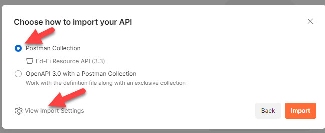
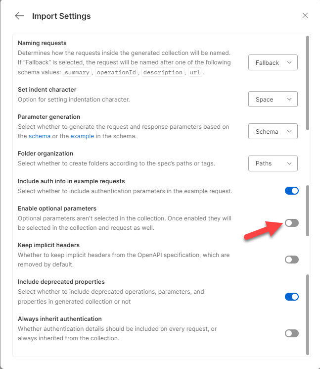

# Import, Cleaning, and Export with Postman

## Import Into Postman

1. In Postman, click the import button.
2. Select the YML file.
3. Choose to import as a Postman collection.\
   
4. Before clicking the import button, modify the settings by turning off
   optional parameters.\
   

## Export to File

1. Click the `...` button at the root of the collection.
2. Choose Export.
3. In the Export Collection window, choose "Collection v2.1".
4. Do NOT click the "share Collection" button. Click the Export button.
5. Save the file in the same directory as the Open API spec file, with the same
   base name (but different extension: `.postman.json` instead of `.yml`).

### Modifying the Base URL for the Resource API

The YML file has routes/endpoints like `/ed-fi/academicWeeks` and
`/tpdm/candidates`. The ODS/API places these routes after `/data/v3`, but this
is not a canonical requirement - hence those two route segments are not in the
YML. But, this means that the Postman import is insufficient. It will have URLs
like `{{baseUrl}}/ed-fi/academicWeeeks`. That `baseUrl` variable is already
defined as `/api` (by default) to support the Discovery API.

So, we need a new variable. The environment files in this repository have
`"resourcesBaseUrl": "{{baseUrl}}/data/v3"`. In Postman, just for the Ed-Fi
Resources API

After exporting the file:

1. Open it in a text editor.
2. Perform a global find-and-replace for `{{baseUrl}}` -->
   `{{resourcesBaseUrl}}`.
3. Save the file.
4. Re-import the `.postman.json` file into Postman, replacing the original
   collection.
